# PROYECTO FINAL - AMBULARTE

## PORTADA

- Título del proyecto: AmbulArte.
- Ciclo Formativo: Desarrollo de Aplicaciones Web
- Centro educativo: I.E.S. “Suárez de Figueroa” 


- Autora del proyecto: María Corcobado Muñoz
- Tutor del proyecto: Miguel Ángel Domínguez Espino
- Fecha de presentación: junio 2025.
- Repositorio del proyecto: [Repositorio](https://github.com/mcorcobadom/AMBULARTE.git)
- Logotipo del proyecto: 


### 1. INTRODUCCIÓN

Ante la situación actual en la que cada vez se recurre a la Inteligencia Artificial para la producción de imágenes e ilustraciones en general de manera rápida y carente de personalidad y autoría, la preocupación de los y las artistas ante esta tesitura no para de crecer. Además, el hecho de que la promoción y el contacto con las personas interesadas en sus obras se haga mayoritariamente a través de redes sociales hace que no siempre lleguen estas producciones a los públicos realmente interesados.

El proyecto final que se presenta a continuación y que tiene como título AmbulArte, pretende responder a la necesidad que tienen los y las artistas poco conocidos/as de vender o enseñar sus obras no sólo a posibles compradores o compradoras, sino también a galerías que quieran realizar exposiciones temáticas o no de las manifestaciones artísticas más actuales.

### 2. OBJETIVOS DEL PROYECTO

Por tanto, el objetivo de este proyecto no es otro que el de crear una aplicación web que facilite la relación entre artistas, compradores y galerías de arte. En definitiva, crear una plataforma visualmente agradable, intuitiva, organizada y funcional para que cualquier persona pueda utilizarla y disfrutar del arte vigente capaz de mostrar las preocupaciones e inquietudes de aquellos que lo crean.

Por otro lado, con la realización de este trabajo también se pretende exponer todo lo aprendido en las materias de Desarrollo de Aplicaciones Web: en la parte del Front-end todo lo relacionado con el diseño, guía de estilo, prototipos, etc. y en la parte de Back-end los conocimientos adquiridos en código. 

### 3. JUSTIFICACIÓN DEL PROYECTO

### 3.1 Análisis del mercado

Desde hace algunos años, las nuevas tecnologías están cambiando la forma en que interactuamos con el arte. De hecho, la globalización y la accesibilidad a todo tipo de información ha facilitado que tengamos más conocimiento sobre las inquietudes y preocupaciones de las manifestaciones artísticas pero, por otro lado, al multiplicarse la cantidad de información que nos llega a través de distintas plataformas, ha hecho que dediquemos menos tiempo a analizar todo lo que nos llega. 
Por ello, creemos que una aplicación web que se dedique únicamente a la selección y clasificación de obras hará más sencilla la tarea para valorar las producciones de sus autores y autoras.

Estos/as artistas, a menudo crean piezas vanguardistas que denuncian problemas que tienen que ver con su contexto, con la época actual que les ha tocado vivir y muchas veces no cuentan con la visibilidad u oportunidad que merecen. 
En este contexto, la creación de una plataforma digital es de vital importancia, ya que servirá de puente entre artistas poco conocidos, compradores o mecenas que no están al tanto de las propuestas más innovadoras que están surgiendo y galerías de arte que suelen centrarse en artistas consagrados o en el mercado de arte ya establecido, relegando a un segundo plano a aquellos/as que abordan temas actuales y que no forman parte de la élite. Con todo, en última instancia, con esta relación también conseguimos generar un espacio de reflexión y conciencia sobre el trabajo que hay detrás de la creación de una obra original, personal que refleja los problemas de una época, algo insustituible por las emergentes inteligencias artificiales. 

### 3.2 Herramientas parecidas que existen en el mercado

A continuación exponemos algunas plataformas que, de alguna manera, tienen que ver con la idea que aquí se plantea, aunque ninguna consigue reflejar al 100% el objetivo que con este proyecto se persigue.

* Saatchi Art: permite a los artistas exhibir sus obras. Facilita la compra y venta de arte de manera poco personalizada.

* Artfinder: conecta a artistas con compradores de arte pero sus precios son poco accesibles.

* Artsy: es la que más se asemeja a nuestra idea. Sirve de conexión entre artistas, galerías y coleccionistas, aunque está generalmente enfocada a artistas con renombre.

* Behance: plataforma para que los artistas muestren su portfolio, pero no está diseñada para la venta o exposición de obras.

* Singular: vende obras de artistas de todo el mundo.

* ArtMajeur: plataforma en la que se pueden encontrar noticias relacionadas con el arte, obras de artistas clasificadas por tipo y artistas a nivel internacional.

Existen otras plataformas donde los artistas suelen compartir sus obras para venderlas como son Instagram o Etsy (tiene una sección de arte), pero su temática principal no es el arte. 

En todas las expuestas anteriormente, la representación de artistas extremeños o españoles es ínfima, algo que no sucede en la web que se presenta en este proyecto.

## 4. RECURSOS UTILIZADOS

### 4.1 Entornos de desarrollo

Durante la realización de este proyecto, se han utilizado distintos entornos de desarrollo integrados (IDE) y herramientas específicas adaptadas a las tecnologías empleadas. A continuación, se detallan los principales entornos utilizados:

#### 4.1.1  Visual Studio Code (VS Code)

Ha sido el editor principal durante todo el desarrollo. Se eligió por su ligereza, amplia compatibilidad con extensiones y buena integración con tecnologías web (HTML, CSS, JavaScript...). Algunas extensiones destacadas fueron:

* Prettier (formateo automático de código)
* Indent-rainbow
* Live Server
* Bootstrap IntelliSense
* PHP IntelliSense

#### 4.1.2  LAMP

Para el desarrollo backend con PHP y MySQL, se ha utilizado LAMP en una máquina virtual cuyo sistema operativo ha sido Ubuntu 24.04. Esta máquina virtual ha permitido levantar un servidor Apache  y gestionar la base de datos con phpMyAdmin.

#### 4.1.3  Git y GitHub

Se usaron como herramientas de control de versiones. Git ha permitido llevar un control preciso de los cambios realizados, mientras que GitHub se ha utilizado para alojar el repositorio del proyecto y facilitar la revisión del proyecto por parte del tutor.

#### 4.1.4  Navegadores Web (Chrome, Firefox)

Los navegadores se utilizaron tanto para realizar pruebas del comportamiento de la aplicación como para usar herramientas de desarrollo (DevTools) que permitieron depurar errores, revisar el rendimiento y validar estilos CSS y estructuras HTML.

### 4.2 Lenguaje de programación

En este proyecto se han utilizado varios lenguajes de programación que cumplen funciones específicas tanto en el frontend como en el backend de la aplicación.

#### 4.2.1 JavaScript

JavaScript es el lenguaje de programación utilizado en el frontend para la creación de la lógica de interacción y dinámicas de la aplicación web. Ha permitido realizar tareas como la validación de formularios, la manipulación del DOM (Document Object Model) y la gestión de interacciones del usuario en tiempo real. Además, se ha utilizado la librería jQuery para facilitar la manipulación del DOM haciendo más sencilla la tarea de selección de elementos HTML, modificación de su contenido y atributos y la gestión de eventos. En concreto, para:

* Manejar eventos como clics y desplazamiento de usuarios.

* Realizar peticiones asincrónicas a través de tecnologías como AJAX para la comunicación con el servidor sin necesidad de recargar la página.

* Mejorar la experiencia del usuario con interacciones rápidas y sin interrupciones.

#### 4.2.2 PHP

Para el backend de la aplicación. Con este lenguaje se ha podido hacer consultas a la base de datos, procesar los datos recibidos desde el frontend y devolver la información adecuada y generar respuestas dinámicas en formato HTML o JSON para ser enviadas al cliente.

#### 4.2.3 HTML

HTML para crear la estructura y organización de todas las páginas del sitio.

#### 4.2.4 CSS

Para definir el diseño de la página, buscando que sea atractiva e intuitiva y para asegurar que la aplicación sea responsive, es decir, que se adapte correctamente a diferentes tamaños de pantalla (móviles, tabletas y escritorios).

Cada uno de estos lenguajes cumple una función específica en el desarrollo de la aplicación web y su combinación permite ofrecer una experiencia de usuario fluida y una gestión eficiente de la lógica del servidor.

### 4.3 Utilidades

Bootstrap, Font Awesome, Pexels, WhatTheFont, Free Icon Sets, Colormind, jQuery, DevTools, API externa, librería Masonry, etc.

## 5. TECNOLOGÍAS DE DESARROLLO

Para el desarrollo de la app web se ha utilizado una combinación de tecnologías frontend, backend y herramientas de despliegue que son las siguientes.

### 5.1 Frontend

* Bootstrap 5: framework CSS utilizado para componentes reutilizables (botones, modales, tablas) y diseño responsivo.

* JavaScript (ES6): para la lógica de interacción en el cliente, validaciones y manipulación del DOM.

* jQuery: librería utilizada para simplificar la manipulación del DOM y realizar peticiones AJAX.

### 5.2 Backend

* MySQL: sistema de gestión de bases de datos relacional para almacenar y gestionar la información de usuarios, obras, pedidos, exposiciones, etc.

* phpMyAdmin: herramienta para la gestión visual de la base de datos.


## 6. DISEÑO DEL PROYECTO

### 6.1 Diseño de la base de datos

La base de datos ha sido diseñada siguiendo principios de normalización y orientada a una estructura extensible y robusta que permita registrar, consultar y gestionar la información relativa a los usuarios (artistas, coleccionistas y galerías), sus obras, pedidos, exposiciones y otras entidades relacionadas. El objetivo principal ha sido garantizar la integridad referencial, la eficiencia en las consultas y la flexibilidad para futuros cambios o ampliaciones.

### 6.1.1 Enfoque de diseño

Se ha adoptado un modelo de generalización/especialización centrado en la tabla usuarios, la cual actúa como entidad general que agrupa los atributos comunes a todos los perfiles que acceden a la plataforma. De esta tabla derivan tres entidades especializadas: artistas, coleccionistas y galerías. Esta relación es de tipo uno a uno (1:1), con un tipo de generalización exclusiva y total, es decir, todo usuario registrado pertenece a una y solo una de las subentidades.

En definitiva, el diseño está orientado a la gestión integral de una plataforma de arte que conecta artistas, coleccionistas, galerías y sus respectivas obras. Se prioriza la normalización, evitando redundancia de datos, y se asegura la integridad referencial mediante claves foráneas bien definidas. La estructura refleja una organización clara de los distintos actores y objetos del sistema, permitiendo una gestión eficiente de obras, exposiciones, pedidos y usuarios.

### 6.1.2 Estructura de claves y relaciones

Las tablas artistas, coleccionistas y galerías tienen como clave primaria "idUsuario" que, a su vez, es clave foránea que referencia a la tabla usuarios. De esta manera, se mantiene la integridad y se evita la redundancia.

Como se puede comprobar, se ha establecido una restricción para estas claves foráneas de tal manera que, en caso de eliminar un usuario, no se eliminan los datos de las subentidades, sino que se marca el usuario como inactivo mediante un campo booleano activo en la tabla usuarios. Para facilitar las posibles consultas de cara a un futuro, este campo también se ha añadido a las tablas "artistas", "coleccionistas" y "galerías".

Dado que los usuarios pueden tener obras asociadas, pedidos o participar en exposiciones, se ha descartado el borrado en cascada. En su lugar, la plataforma permite desactivar cuentas (campo "activo" en la tabla usuarios), conservando los datos en la base para no comprometer el historial de registros.

En cuanto a la estructura, se apoya fuertemente en claves primarias y claves foráneas para establecer relaciones sólidas entre las tablas:
Usuarios es la tabla raíz para todos los roles del sistema. De ella dependen artistas, coleccionistas y galerías, que utilizan el idUsuario como clave foránea (idArtista, idColeccionista, idGaleria respectivamente), garantizando que todo actor esté vinculado a una cuenta de usuario.

Las obras se vinculan directamente a:

* Un artista (idArtista)
* Una categoría (idCategoria)

Pueden estar asociadas a múltiples exposiciones mediante la tabla puente "obras_exposicion".

La tabla pedidos se relaciona con un coleccionista y se detalla a través de detallesPedidos, donde se especifican las obras compradas y sus precios individuales. Se ha incluido aquí el precio de la obra para evitar en un futuro datos erróneos con los precios que un coleccionista haya podido pagar al adquirir una, ya que un artista puede editar sus obras y, si decide cambiar el precio de venta, en los pedidos también se cambiarían. De esta manera, el precio de la obra se mantiene en los pedidos como el precio que tuvo al adquirirse.

La tabla "exposiciones" está ligadas a "galerías", y permite registrar las fechas de exposición de cada obra mediante la tabla obras_exposicion.

La mayoría de las relaciones son de uno a muchos (1:N), salvo aquellas representadas en tablas puente como detallesPedidos y obras_exposicion, que implementan relaciones muchos a muchos (N:M).

### 6.1.4. Estado de actividad y control de vigencia

Las entidades principales (artistas, coleccionistas, galerías, usuarios) incluyen un campo llamado "activo" (boolean), que permite identificar si un usuario se ha dado de baja o no. Esto facilita la implementación de desactivación lógica, evitando la eliminación física de registros y permitiendo su recuperación posterior.
Por otro lado, también se deja constancia de si el perfil está completado mediante el campo "perfilCompletado", útil para la gestión de accesos y la experiencia del usuario dentro del sistema.

### 6.1.5. Registro de auditoría

Para mantener trazabilidad y control de errores, se ha añadido una tabla auditoría donde se almacenan eventos significativos del sistema, incluyendo errores, inserciones, actualizaciones y eliminaciones. Esta tabla será alimentada automáticamente mediante "triggers" definidos para las tablas.

Cada entrada incluye:

* La tabla afectada (nombreTabla).
* El tipo de acción (INSERT, UPDATE, DELETE, ERROR).
* Los datos anteriores y nuevos (en formato texto).
* El usuario responsable de la acción.
* La fecha y hora exacta del evento.

### 6.1.5. Uso general del sistema

El sistema está diseñado para facilitar la interacción entre los distintos actores del mundo artístico:

Todos los usuarios, independientemente de que estén registrados o no, pueden explorar el catálogo de la web. Por otro lado, como usuarios registrados:

* Los artistas pueden iniciar sesión, completar o modificar su perfil, añadir, editar o eliminar obras.

* Los amantes del arte (coleccionistas) pueden iniciar sesión, completar o modificar su perfil, comprar obras y consultar, modificar o eliminar sus pedidos.

* Las galerías tienen la posibilidad de iniciar sesión, completar o modificar su perfil y añadir, modificar o eliminar exposiciones.

* El administrador puede iniciar sesión, añadir, modificar o eliminar usuarios (artista, galería o coleccionista) y auditar operaciones.

Además, el sistema incorpora suscripciones mediante la tabla  "newsletter", permitiendo a visitantes o usuarios recibir comunicaciones periódicas por correo electrónico.

#### 6.1.6 Diagrama E/R

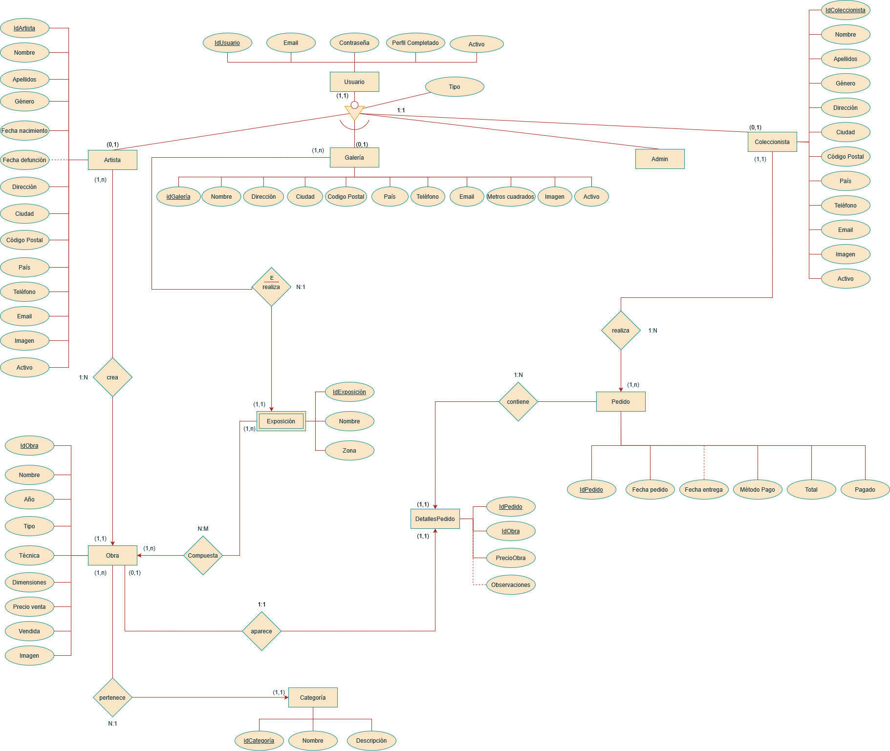

#### 6.1.7 Modelo Relacional

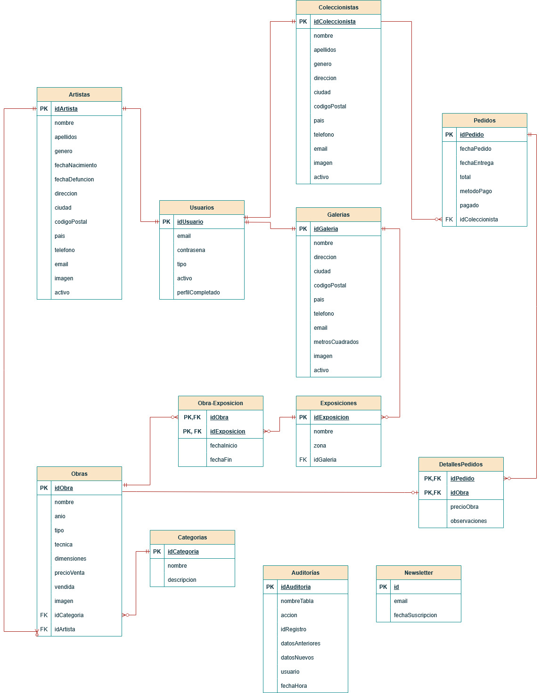

### 6.2 Carga de datos inicial


### 6.3 Diseño de la interfaz de usuario

[Enlace a Figma](https://www.figma.com/design/Vd7FqZjcSoBDLQFEt0K0Ls/AmbulArte?node-id=0-1&p=f&t=j2DxFDZYU5DzCR2Z-0)

En cuanto al diseño de AmbulArte, se ha estructurado con el objetivo de ofrecer una experiencia visual atractiva y una navegación intuitiva. 

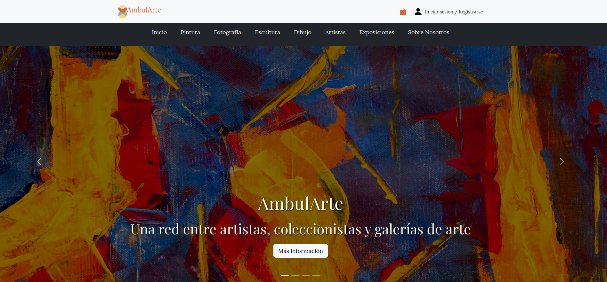

Se han utilizado las siguientes herramientas de diseño:

* Figma: para el diseño de la interfaz de usuario y la creación de prototipos.

* Canva: para la creación del logo y favicon de AmbulArte.

* Google Fonts: para la selección de tipografías utilizadas en la web.

Por otro lado, se han usado variables css para facilitar el mantenimiento y la consistencia visual. Con ellas, se han cambiado colores, tamaños y espaciados de los elementos de una forma más sencilla, garantizando que los estilos sean uniformes en toda la web.

En lo que respecta a la tipografía, se utilizan las fuentes Lora para el texto y Playfair Display para los títulos. El resultado es una apariencia elegante y con un estilo particular relacionado con la temática de la web.

Los colores pueden verse en la guía de estilo del enlace a Figma. Se puede comprobar cómo en todas las páginas se juega con los colores del logotipo de AmbulArte para los distintos botones de la web.

Por otro lado, los espaciados están definidos en el css mediante variables --space y son utilizados para mantener consistencia en márgenes y rellenenos.

Respecto a la accesibilidad, con el objetivo de mejorar la legibilidad, se han utilizado colores que hacen contraste y tamaños aceptables para hacer a los elementos fácilmente clicables. 


Se puede observar que el diseño de elementos como botones, cards o contenedores de secciones siempre tienen unos márgenes redondeados para jugar también con las formas del logotipo de AmbulArte. 

Las cabeceras de secciones tienen fondos personalizados con imágenes relacionadas con el título de la cabecera para que la apariencia visual sea más atractiva y lógica. Se añade en todas las cabeceras el título de la sección con texto superpuesto con sombras para mejorar la legibilidad. Además, la altura de esta cabecera se ajusta al tamaño de pantalla de los distintos dispositivos.

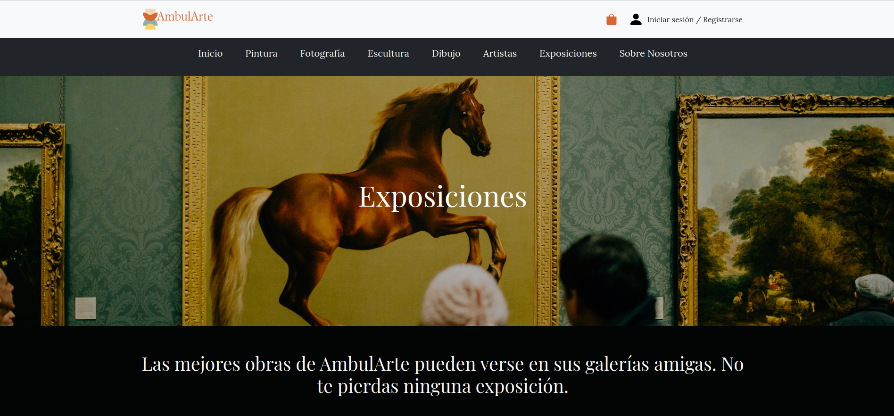

Hay que destacar también las diferentes cards que se pueden encontrar por las páginas que cambian su diseño dependiendo de si son artistas, obras, asistentes o dedicadas a secciones de la web. Se han añadido distintas animaciones o transiciones a estos elementos para invitar a los usuarios a la interacción y navegación por las diferentes páginas de la web.

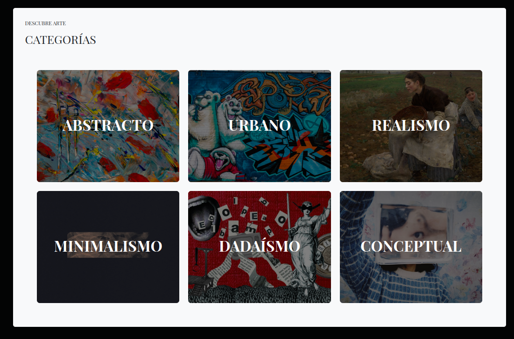

#### Accesibilidad 

En el planteamiento del diseño de esta plataforma se puso especial atención para que fuera accesible a todos los tipos de usuarios. Para ello: 

* Se han empleado etiquetas semánticas HTML como `<header>`, `<main>`, `<section>`, `<footer>` y `<nav>` para estructurar el contenido de manera lógica y facilitar la navegación mediante lectores de pantalla.

* Los formularios incluyen etiquetas `<label>` asociadas a los campos de entrada (`<input>` y `<textarea>`), lo que mejora la comprensión para usuarios con tecnologías asistivas.

* Se utilizan atributos ARIA (`aria-label`, `aria-labelledby`, `aria-hidden`, etc.) para proporcionar información adicional a los lectores de pantalla y mejorar la interacción con elementos dinámicos como modales y menús desplegables.

* La paleta de colores utilizada asegura un contraste adecuado entre el texto y el fondo, cumpliendo con los estándares de accesibilidad (WCAG 2.1).

* Los botones y enlaces tienen colores suficientemente contrastantes para ser fácilmente distinguibles.

* Los elementos interactivos como botones, enlaces y formularios son accesibles mediante el teclado, permitiendo a los usuarios navegar por la web sin necesidad de un ratón.
* Los modales y menús desplegables se pueden abrir y cerrar con el teclado.

* Los elementos interactivos, como botones y enlaces, tienen indicadores visuales al recibir el foco (`:focus`), lo que ayuda a los usuarios a identificar dónde se encuentran en la página.

* Las imágenes incluyen atributos `alt` descriptivos para proporcionar contexto a los usuarios que no pueden verlas.

* Los iconos de redes sociales y otros elementos gráficos tienen descripciones accesibles.

* La web está optimizada para dispositivos móviles y pantallas de diferentes tamaños, asegurando que el contenido sea accesible en cualquier dispositivo.

* Los menús y elementos de navegación se adaptan a pantallas pequeñas mediante un diseño "offcanvas".

* Los formularios incluyen validaciones claras y mensajes de error accesibles que informan al usuario sobre los campos obligatorios o errores en los datos ingresados.

* Los mensajes de error se muestran con colores y estilos que los hacen fácilmente identificables.

* Los elementos interactivos como botones y enlaces tienen un tamaño adecuado para facilitar su clic en dispositivos táctiles y se evita el uso de contenido que parpadee o se mueva rápidamente, reduciendo el riesgo de provocar molestias a usuarios con epilepsia fotosensible.

* Los documentos legales (Aviso Legal, Política de Cookies, Política de Privacidad) están disponibles en formato PDF y son accesibles desde el pie de página.

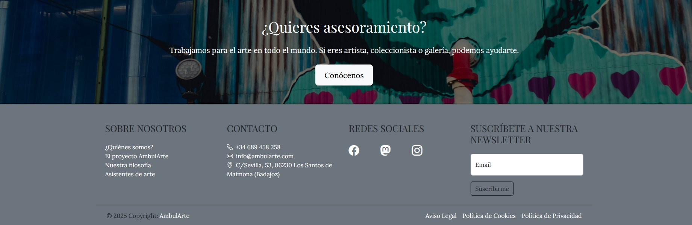

### 6.4 Roles de la aplicación y descripción de los mismos

En el diagrama se pueden ver las funciones que pueden realizar los distintos actores en la app. En otras secciones serán desarrolladas estas funciones y el código desarrollado para ellas.

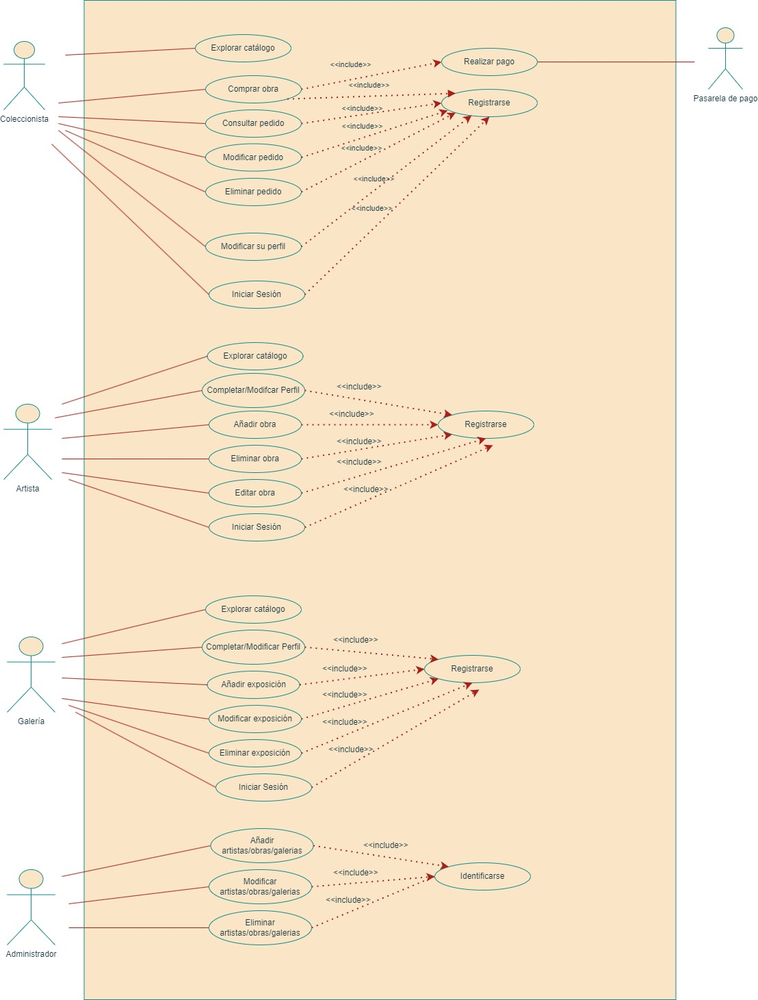

### 6.5 Usuarios creados para pruebas

Hay cuatro usuarios creados para pruebas, uno de cada tipo. A continuación se muestran los correos electrónicos y contraseñas para cada uno: 

* artista@ambularte.com -> Artista1!
* coleccionista@ambularte.com -> Coleccionista1!
* galeria@ambularte.com -> Galeria1!
* admin@ambularte.com -> Admin123!

Ninguno de estos usuarios tiene el perfil completado, por tanto, en su perfil, al iniciar sesión, aparecerá la foto por defecto para cada tipo de usuario. En el caso de “admin”, sólo se mostrará el botón de “Configuración” y “Cerrar Sesión”, puesto que será el encargado de administrar la página y la única información que se requiere de él es el correo y contraseña. 

Si se quiere probar la funcionalidad de la AmbulArte con usuarios con el perfil completo, se pueden usar estas credenciales para iniciar sesión:

* inmaculadabonet@ambularte.com -> Artista1!
* edmundovalles@ambularte.com -> Coleccionista1!
* marujamayo@ambularte.com -> Galeria1!

## 7. LÓGICA/CODIFICACIÓN DEL PROYECTO

### 7.1 Lógica del frontend

#### 7.1.1 Estructura del proyecto

El proyecto está organizado en carpetas que separan los distintos componentes de la aplicación:

* php/: contiene los scripts backend en PHP para gestionar las operaciones con la base de datos.
* js/: contiene los scripts frontend en JavaScript para manejar la interacción del usuario y las peticiones AJAX.
* css/: contiene los estilos personalizados para la aplicación.
Los archivos html se presentan en la carpeta AMBULARTE. 
* doc: incluye documentación del proyecto, como el archivo README.md y el diseño de la base de datos (AmbulArte.sql).
* images/: almacena imágenes utilizadas en la interfaz, como logotipos y fotos de perfil.
* bbdd/: contiene el archivo SQL para la creación de la base de datos.

El archivo myscript.js contiene la lógica principal del frontend para la interacción del usuario en la página web. Utiliza jQuery para manejar eventos, realizar peticiones AJAX y manipular el DOM dinámicamente. Aquí está la explicación de las principales funcionalidades:

#### 7.1.2 Gestión de usuarios 

Inicialmente, para visualizar los contenidos de la web, no hace falta un registro o inicio de sesión previo. Sin embargo, si los usuarios desean disfrutar de más funcionalidades, deberán obligatoriamente registrarse y, a continuación, iniciar sesión.

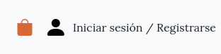

Las principales funcionalidades para la interacción de los usuarios con la web se explican a continuación.

Al pulsar en el botón Iniciar Sesión / Registrarse, aparece un modal que se alterna según el usuario tenga cuenta o no. 

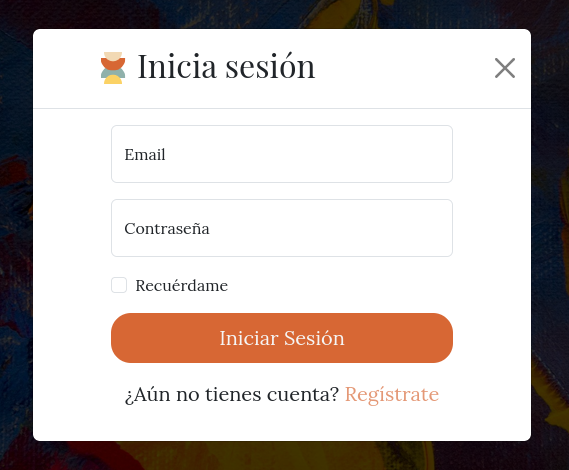

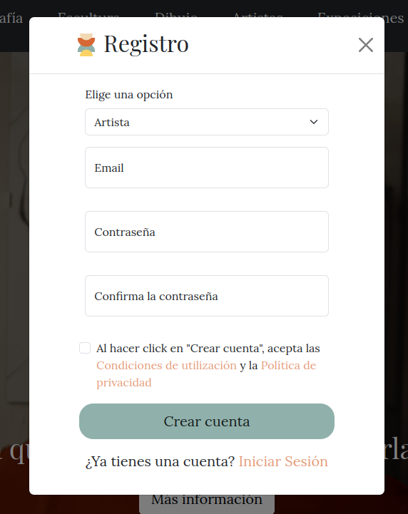

* Registro de usuarios

Si se abre el modal de registro, se deberá seleccionar un tipo de usuario (artista, amante del arte (coleccionista) o galería), introducir un correo electrónico válido y una contraseña. Si se cometiera algún error en el intento de registro, se muestra un mensaje al usuario indicando dónde está el problema ("el email ya está registrado", "el email o contraseña no cumplen con los requisitos" o "las contraseñas introducidas no coinciden"). 

Una vez que el registro se completa correctamente, estos datos se introducen en la tabla “usuarios”. 

Valida los datos del formulario de registro, como contraseñas coincidentes y aceptación de términos.
Envía los datos al backend (php/registro.php) para crear la cuenta.
Muestra mensajes de éxito o error según la respuesta del servidor.

* Inicio de sesión de usuarios

El usuario puede iniciar sesión pulsando en el botón que aparece en el header de la web. Se abrirá un modal para iniciar sesión y, en el caso de que el usuario no esté registrado, en ese mismo modal se muestra un enlace para completar el registro. 

Al iniciar sesión, desaparecerá el botón inicial del header de “iniciar sesión / registrarse” y aparecerá un Dropdown con una foto por defecto que cambiará según el tipo de usuario. Al pulsar el botón, si el usuario no ha completado su perfil (se indica en el campo “perfilCompletado” de la tabla usuarios que, al registrarse se  establece como 0), la opción de configuración no se mostrará y, además, en el botón de “Perfil” aparece un icono en rojo con un signo de exclamación señalando que el perfil debe ser completado.

Se validan las credenciales del usuario y realiza una petición AJAX al backend (php/login.php) para autenticarlo.
Si el inicio de sesión se completa con éxito, se guardan los datos del usuario en localStorage y se actualiza la interfaz para mostrar las opciones personalizadas según el tipo de usuario.

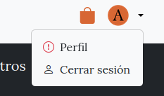

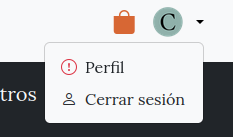

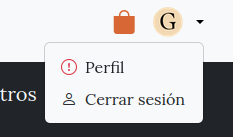

El usuario admin no debe completar perfil, así que cuando inicia sesión, aparece el saludo y la foto por defecto

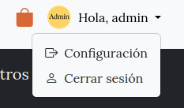

Si el usuario tuviera el perfil completado, el dropdown se mostraría así:

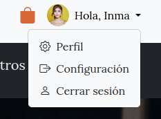

* Perfil de usuario

Si se pulsa en el botón “Perfil” del Dropdown, se carga dinámicamente la página“perfilUsuario.html” en la sección dinámica de “index.html”. Aquí, el usuario puede completar todos los datos que se enviarán a las tablas de cada tipo de usuario. Si se observa en la base de datos, hay algunos campos distintos para “artistas”, “coleccionistas” y “galerías”, por eso, cuando se inicia sesión, se recoge el tipo de usuario y se muestran los inputs respectivos para cada tipo. Para la foto de perfil, se puede seleccionar un archivo del repositorio local y se muestra debajo del input la foto que tiene actualmente el usuario. En el caso de que se cambie la imagen, la vista previa de esta cambiaría.
En el formulario de perfil se muestra la imagen del usuario si hay registros en la base de datos y se actualiza la vista previa si elige una nueva para modificar la actual.  

Una vez que se pulsa el botón “Guardar”, se introducen los datos en la tabla correspondiente al tipo de usuario y “perfilCompletado” se pondría a 1. Cuando se cierra el modal, se recarga la página y se cambia la imagen de perfil (si el usuario ha subido alguna) y en el dropdown ya son funcionales los botones “Perfil” y “Configuración”. Si se vuelve a pulsar en perfil, aparece el formulario con los campos completados que se obtienen de la base de datos.

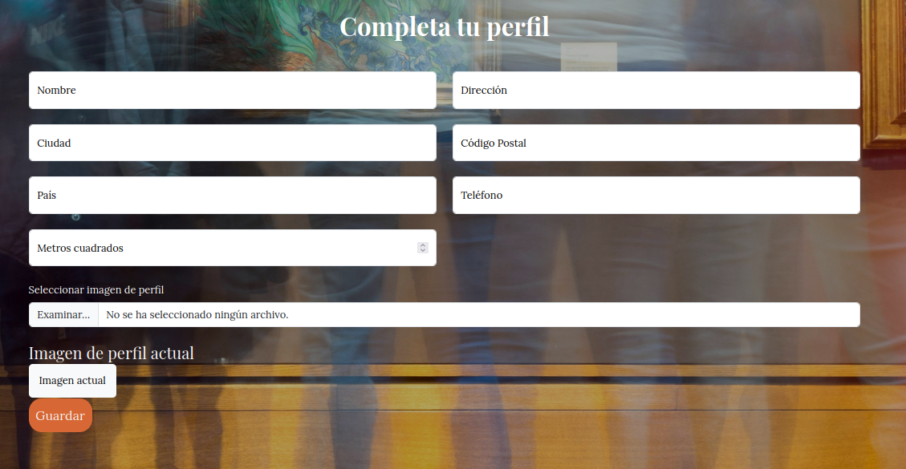


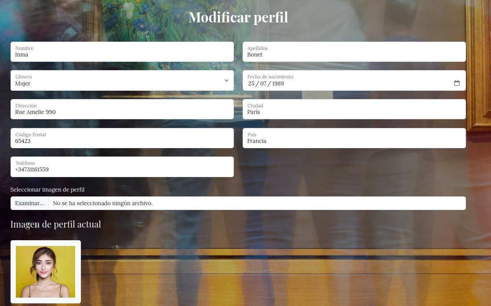

* Cerrar sesión

El botón de cerrar sesión del dropdown, limpia el localStorage y actualiza la interfaz para mostrar el estado de no logueado.

* Cargar configuración

El botón de configuración del dropdown sólo se muestra para aquellos usuarios que ya han completado su perfil, como hemos podido ver en imágenes anteriores. 

Según el tipo de usuario (artista, coleccionista, galería o admin), se carga dinámicamente la página de configuración correspondiente (configuracionArtista.html, configuracionColeccionista.html, etc.).

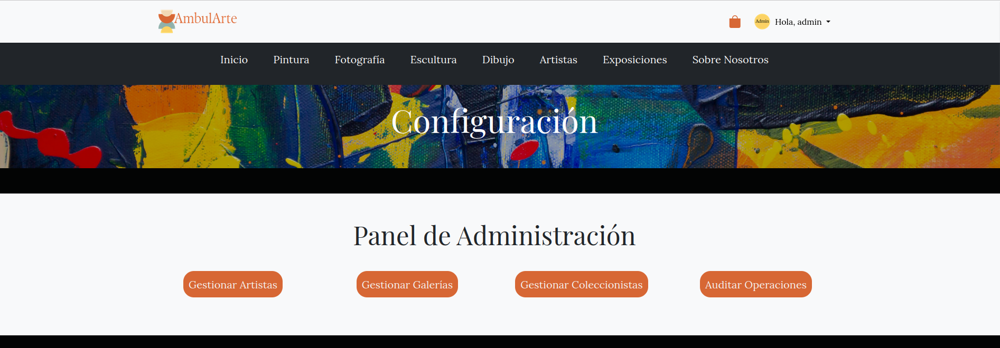

#### 7.1.3 Navegación dinámica

* Navegador de secciones

El usuario puede explorar el contenido de la web de manera más rápida por el navegador principal. Este le llevará a descubrir obras clasificadas por tipo (dibujo, pintura, escultura...), a visualizar a todos los artistas de AmbulArte, a informarse de las exposicioes o a informarse de qué es AmbulArte.

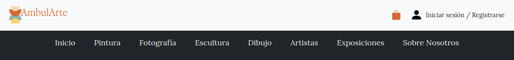
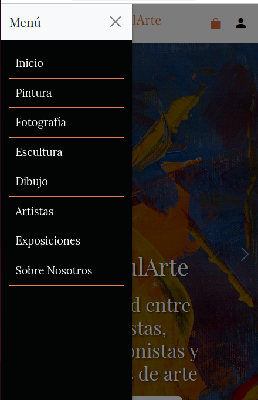

En el footer también hay enlaces de navegación con anclas a las distintas partes de la página Sobre Nosotros.


* Cargar secciones:

Según la interacción del usuario (clic en un botón o enlace del navegador de secciones), se oculta la sección principal (#principal) y se carga dinámicamente el contenido correspondiente en el contenedor #seccionDinamica.
Esto se realiza mediante la función cargarPaginaNavegadorSecciones, que utiliza AJAX para cargar archivos HTML específicos (como configuracionArtista.html, configuracionColeccionista.html, etc.).

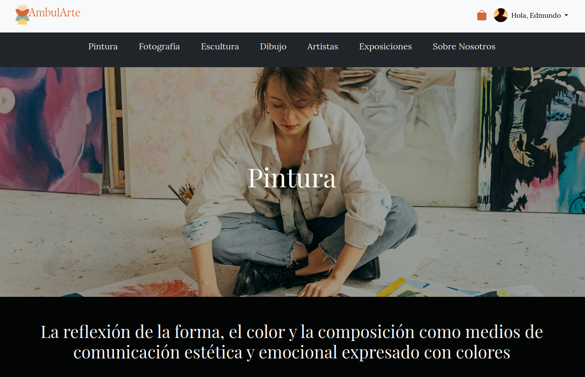

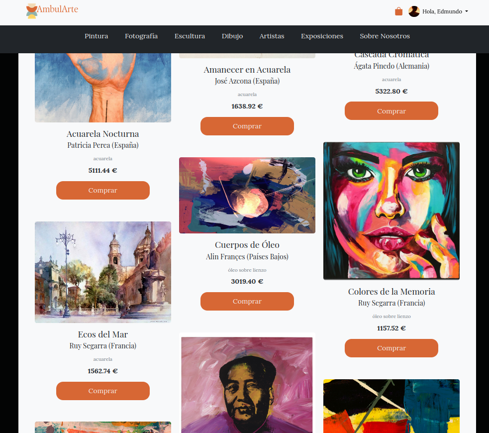

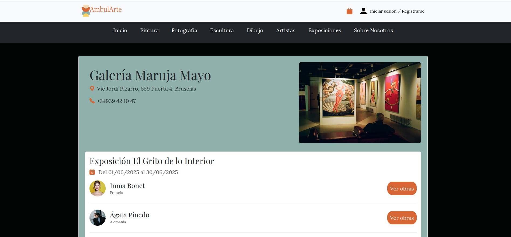

* Cargar categorías, novedades y galerías:

Las categorías, novedades (artistas destacados) o galerías disponibles que se muestran en las secciones de la página de inicio, se obtienen del backend mediante una petición AJAX (php/cargarCategorias.php, cargarNovedades.php, cargarGalerias.php...) y se muestran como cards dentro de las distintas secciones.


#### 7.1.4 Carrito de la compra

El carrito de la compra aparece en navegador siempre, aunque no se haya iniciado sesión. Sin embargo, si un usuario no registrado o no logueado pulsa en comprar una obra artística, se le informará de que debe estar registrado para ello. Además, si está logueado y no es coleccionista, se le mostrará un mensaje indicando que se registre como coleccionista.

En el caso de que el usuario logueado sea coleccionista, podrá:

* Añadir obras al carrito: se agrega una obra al array carrito (variable global) y actualiza el contenido del carrito en el offcanvas. Verifica si la obra ya está en el carrito para evitar duplicados, ya que las obras de la plataforma son únicas. Además, se cuenta cuántos elementos hay en el carrito para mostrarlo en el badge del icono.

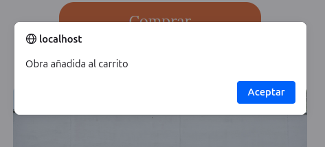

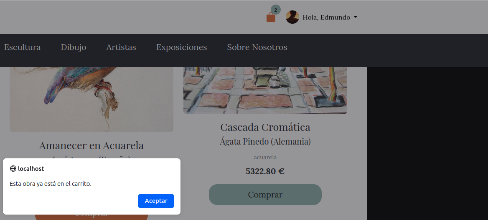

* Eliminar obras del carrito: se elimina una obra del array carrito y actualiza la interfaz.

* Confirmar compra: se verifica que el usuario esté logueado y sea del tipo "coleccionista".

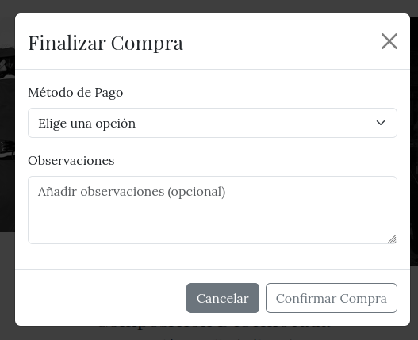

Envía los datos del carrito y la información de pago al backend (php/confirmarCompra.php) para procesar la compra.

#### 7.1.5 Suscripción al newsletter

Si cualquier usuario de la web introduce un email para suscribirse al newsletter, se valida el email ingresado y lo envía al backend (php/suscribirNewsletter.php) para registrarlo en la tabla newsletter de la base de datos.

#### 7.1.6 Funcionalidad de los archivos HTML y sus scripts JavaScript

Además de index.html y myscript.js, la aplicación cuenta con otros archivos HTML y scripts JavaScript que gestionan funcionalidades específicas. A continuación, se describe la lógica de cada archivo y su interacción con el sistema:

##### 7.1.6.1. configuracionArtista.html y scriptConfiguracionArtista.js

Este archivo HTML permite a los artistas gestionar sus datos y obras.
El script asociado (scriptConfiguracionArtista.js) maneja las siguientes funcionalidades:

* Añadir obra: permite al artista registrar una nueva obra en la base de datos.
* Modificar obra: actualiza los datos de una obra existente.
* Eliminar obra: marca la obra como inactiva para que no aparezca en el catálogo.
* Listar obras: muestra las obras registradas por el artista en formato de tabla o cards.

##### 7.1.6.2. configuracionColeccionista.html y scriptConfiguracionColeccionista.js

Este archivo HTML permite a los coleccionistas gestionar su perfil y consultar su historial de compras.

El script asociado (scriptConfiguracionColeccionista.js) maneja las siguientes funcionalidades:

* Consultar historial de compras: muestra los pedidos realizados por el coleccionista.
* Gestionar datos personales: permite al coleccionista actualizar su información de contacto.

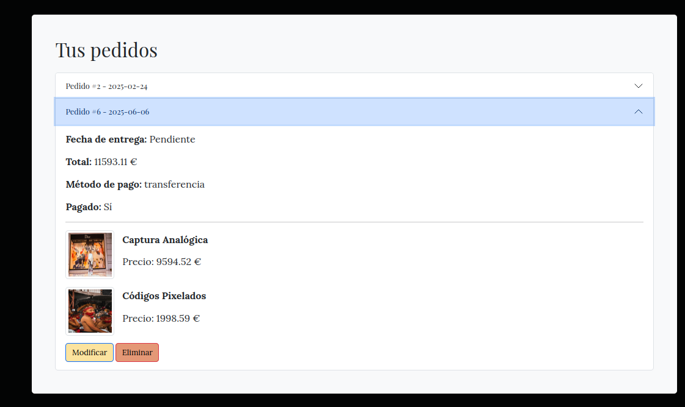

##### 7.1.6.3. configuracionGaleria.html y scriptConfiguracionGaleria.js

Este archivo HTML permite a las galerías gestionar sus exposiciones y datos.
El script asociado (scriptConfiguracionGaleria.js) maneja las siguientes funcionalidades:

* Añadir exposición: permite registrar una nueva exposición en la base de datos.
* Modificar exposición: actualiza los datos de una exposición existente.
* Eliminar exposición: marca la exposición como inactiva.
* Listar exposiciones: muestra las exposiciones registradas por la galería.

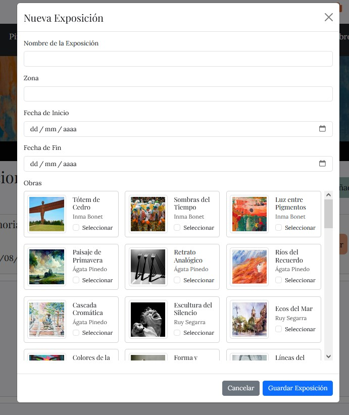

##### 7.1.6.4. configuracionAdmin.html y scriptConfiguracionAdmin.js

Este archivo HTML permite al administrador gestionar usuarios y auditorías.
El script asociado (scriptConfiguracionAdmin.js) maneja las siguientes funcionalidades:

1. Gestionar usuarios.

Si se pulsa el botón "Gestionar artistas", se muestra una tabla con los datos de los artistas registrados, como nombre, apellidos, país, teléfono, email y estado (activo/inactivo). A su vez, existen otros botones con los que el administrador podrá:

* Añadir un artista.
* Modificar un artista.
* Eliminar un artista (poner el campo activo a 0).
* Reactivar a un artista (poner el campo activo a 1).

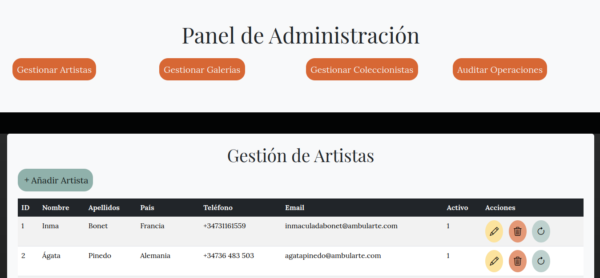

Al igual que con artista, estas opciones también están disponibles para los usuarios "galerías" y "coleccionistas".

4. Auditoría de operaciones.

Al pulsar este botón, se le permite al administrador supervisar y rastrear los cambios realizados en el sistema. Se muestra una tabla con el historial de cambios realizados por los usuarios, incluyendo:

* ID de la auditoría.
* Nombre de la tabla afectada.
* Acción realizada (crear, modificar, eliminar).
* ID del registro afectado.
* Datos anteriores y nuevos.
* Usuario que realizó la acción.
* Fecha y hora de la operación.

Los datos de las tablas se cargan dinámicamente desde el backend mediante solicitudes AJAX.
Los formularios para añadir o modificar se adaptan según el tipo de usuario (artista, galería o coleccionista) para mostrar campos específicos de sus respectivas tablas, al igual que sucede con el formulario de perfil de usuario. En cuanto a la validación y confirmación de cambios, antes de realizar acciones como eliminar o reactivar usuarios, se solicita confirmación al administrador.

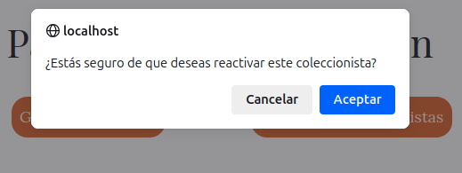

##### 7.1.6.5. perfilUsuario.html y scriptPerfilUsuario.js

Este archivo HTML permite a los usuarios completar o modificar su perfil. El script asociado (scriptPerfilUsuario.js) maneja las siguientes funcionalidades:

* Cargar datos del perfil: obtiene los datos del usuario desde la base de datos y los muestra en el formulario.
* Actualizar perfil: envía los datos modificados al backend para actualizar la información del usuario.

##### 7.1.6.6. exposiciones.html y scriptExposiciones.js

Este archivo HTML muestra las exposiciones activas en la plataforma. El script asociado (scriptExposiciones.js) maneja las siguientes funcionalidades:

* Listar exposiciones: obtiene las exposiciones activas desde el backend y las muestra en formato de cards.
* Filtrar exposiciones: permite buscar exposiciones por galería o fecha.

##### 7.1.6.7. obras.html y scriptObras.js

Este archivo HTML muestra las obras disponibles en la plataforma. El script asociado (scriptObras.js) maneja las siguientes funcionalidades:

* Listar obras: obtiene las obras activas desde el backend y las muestra en formato de cards.
* Filtrar obras: permite buscar obras por categoría, artista o precio.

### 7.2 Lógica del Backend

El backend del proyecto está diseñado para manejar las operaciones del sistema, procesar datos y comunicarse con el frontend. Utiliza PHP para la lógica del servidor y MySQL para la gestión de la base de datos. 
Cada funcionalidad del backend está asociada a un archivo PHP específico que se encarga de procesar las solicitudes del frontend, interactuar con la base de datos y devolver las respuestas necesarias. Esto asegura una separación clara de responsabilidades y facilita el mantenimiento del código.

A continuación, se detalla la lógica del backend:

#### 7.2.1 Gestión de usuarios (gestionarUsuariosAdmin.php)

Este archivo actúa como el backend para gestionar las operaciones relacionadas con los usuarios en el sistema AmbulArte manejando diferentes tipos de usuarios (artistas, galerías y coleccionistas) y permitiendo realizar acciones como listar, añadir, modificar, eliminar y reactivar usuarios.

Las funciones principales de este archivo son: 

1. Listar usuarios

Se recuperan todos los registros de un tipo específico de usuario (artista, galería, coleccionista) desde la base de datos y se devuelve un JSON con los datos de los usuarios o un mensaje de error si no se encuentran registros.

2. Obtener un usuario

Se recuperan los datos de un usuario específico según su ID y tipo (artista, galería, coleccionista) y se devuelve un JSON con los datos del usuario o un mensaje de error si no se encuentra.

3. Añadir un usuario

Se crea un nuevo usuario en el sistema. Inserta los datos básicos en la tabla usuarios y los datos específicos en la tabla correspondiente (artistas, galerías, coleccionistas)Para ello, se verifica que el email no esté duplicado y se validan los campos obligatorios según el tipo de usuario. Por último, se devuelve un mensaje de éxito o un error si ocurre algún problema.

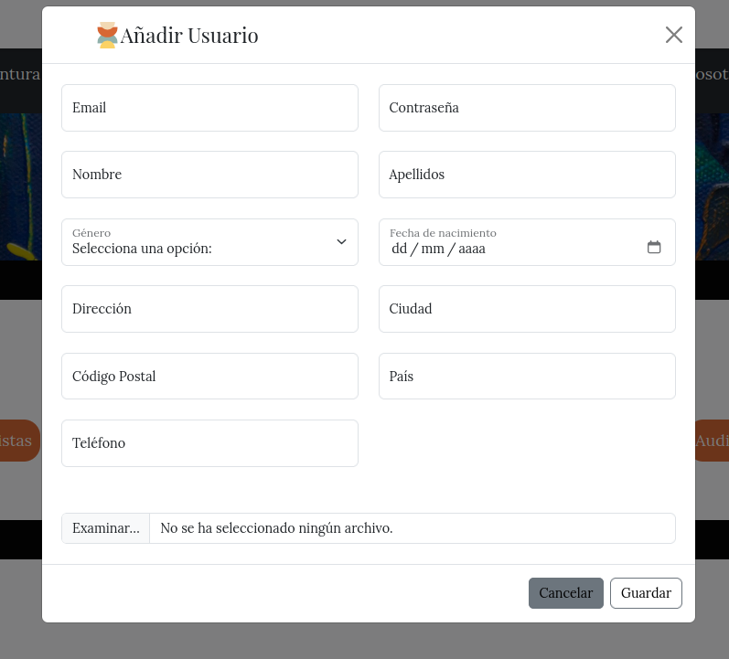

4. Modificar un usuario

Se actualizan los datos de un usuario existente en la tabla correspondiente (artistas, galerías, coleccionistas). Se verifica que los campos obligatorios estén presentes y se validan campos específicos según el tipo de usuario. Se devuelve un mensaje de éxito o un error si ocurre algún problema.

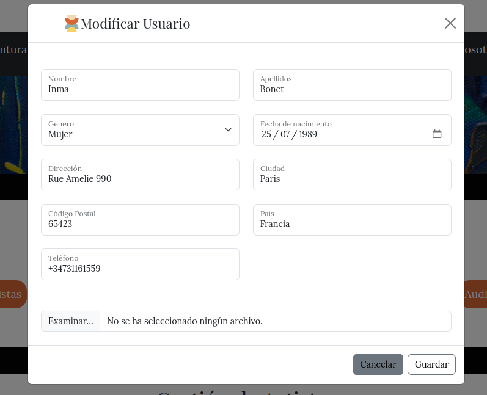

5. Eliminar un usuario

Se marca a un usuario como inactivo en la tabla usuarios y en la tabla específica correspondiente (artistas, galerías, coleccionistas). Antes de esto, se verifica que el usuario no esté ya inactivo. Por último, devuelve un mensaje de éxito o un error si ocurre algún problema.

6. Reactivar un usuario

Se marca un usuario como activo en la tabla usuarios y en la tabla específica correspondiente (artistas, galerías, coleccionistas). Antes de esto, se verifica que el usuario no esté ya activo. Para terminar, devuelve un mensaje de éxito o un error si ocurre algún problema.

#### 7.2.5. Auditoría (auditarOperaciones.php)

* Registrar eventos

Cada acción significativa (INSERT, UPDATE, DELETE, ERROR) se registra en la tabla auditoría. Se incluye información como la tabla afectada, el tipo de acción, los datos anteriores y nuevos, el usuario responsable y la fecha/hora del evento.

* Consultar auditoría

Devuelve los registros de auditoría en formato JSON para que el administrador los visualice en la interfaz.

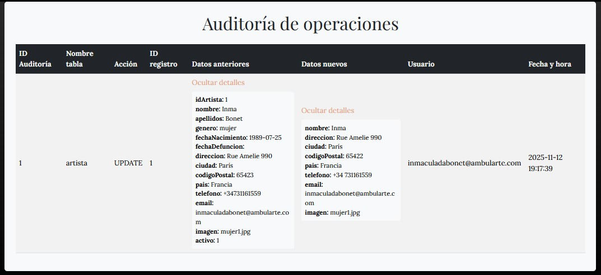

#### 7.2.6. Procesamiento de compras del coleccionista (confirmarCompra.php)

* Confirmar compra

Se verifica que el usuario sea del tipo "coleccionista", se insertan los datos del pedido en la tabla pedidos y los detalles en detallesPedidos. Por último, se actualiza el estado de las obras compradas (marcándolas como vendidas para que no vuelvan a aparecer en el catálogo).

#### 7.2.7. Suscripción al newsletter (suscribirNewsletter.php)

* Registrar suscripción

Se inserta el email del usuario en la tabla newsletter y devuelve una respuesta al frontend indicando si la suscripción tuvo éxito.

## 8. DESPLIEGUE WEB DEL PROYECTO

En esta parte del documento se especifican las instrucciones para instalar, configurar, ejecutar y utilizar la demo en base a los ficheros proporcionados. 

### 8.1 Requisitos

* Sistema Operativo: compatible con Windows, Linux, o Mac OS.

### 8.2 Software requerido

* Servidor Web con PHP: Apache con PHP (versión 7.4 o superior).
* Base de Datos: MySQL con phpMyAdmin para la gestión de la base de datos.
* Navegador Web: última versión de Google Chrome, Mozilla Firefox, o Safari.
* Editor de código: cualquier editor de texto como Visual Studio Code.
* Conectividad: conexión a Internet para descargar paquetes y realizar pruebas de
conectividad.

### 8.3 Instalación y configuración

Paso 1: descargar y configurar XAMPP Control Panel

1. Descargar XAMPP:

* Página oficial de XAMPP: https://www.apachefriends.org/index.html

Paso 2: ejecutar XAMPP como administrador

1. Abrir XAMPP:

* Ve al menú de inicio (o a la carpeta de instalación) y busca "XAMPP Control
Panel".
* Haz clic derecho sobre "XAMPP Control Panel" y selecciona "Ejecutar como
administrador".

2. Iniciar servicios:

* En el panel de control de XAMPP, localiza las filas de "Apache" y "MySQL".
* Haz clic en el botón "Start" para ambos servicios.
* Asegúrate de que ambos servicios estén funcionando (los indicadores deben
cambiar a verde)

Paso 3: configurar la carpeta de localhost

1. Localizar la carpeta htdocs:

* Navega hasta el directorio donde instalaste XAMPP (por defecto suele ser
C:\xampp).
* Abre la carpeta htdocs.

2. Copiar archivos del proyecto:

* Copia la carpeta del proyecto dentro de la carpeta htdocs.
* La estructura debería quedar como C:\xampp\htdocs\CarpetaDelProyecto.

Paso 4: abrir los archivos necesarios en el navegador

1. Acceder al Localhost:

* Abre tu navegador web.
* En la barra de direcciones, escribe http://localhost/nombreCarpetaProyecto/index.html y presiona Enter.

* Deberías ver la página de inicio de la aplicación cargada en el navegador.

Paso 5: importar la base de datos al MySQL

1. Acceder a phpMyAdmin:

* En el navegador, abre una nueva pestaña y escribe http://localhost/phpmyadmin y presiona Enter o presiona el botón de admin para que lo abra en el navegador predeterminado.

2. Importar la base de datos:

* Haz clic en la pestaña "Import" en la parte superior.More actions
* Haz clic en "Choose File" y selecciona el archivo SQL (esta en la carpeta de
db-init del proyecto. Primero importa el archivo de estructura y luego el de datos).
* Haz clic en "Go" para importar el archivo. 

## 🐳 Despliegue con Docker Compose (Recomendado)

### Requisitos
- [Docker Desktop](https://www.docker.com/products/docker-desktop/) instalado
- [Docker Compose](https://docs.docker.com/compose/install/) (incluido en Docker Desktop)
- Puertos 8080, 8081 y 3307 disponibles

### 🚀 Instalación con Docker Compose

#### 1. Descargar el proyecto
```bash
# Opción A: Clonar repositorio
git clone https://github.com/mcorcobadom/AMBULARTE.git
cd AMBULARTE

# Opción B: Descargar ZIP
# 1. Ir a https://github.com/mcorcobadom/AMBULARTE.git
# 2. Clic en "Code" > "Download ZIP"
# 3. Extraer en carpeta local
# 4. Abrir terminal en carpeta AMBULARTE/
```

#### 2. Ejecutar aplicación
```bash
# 🚀 MONTAR CONTENEDORES - Construir y ejecutar todos los servicios
docker-compose up --build

# ✅ Cuando veas: "AmbulArte disponible en http://localhost:8080"
# ⏳ Tiempo de instalación: 3-5 minutos

# 🔧 Ejecutar en segundo plano (opcional)
docker-compose up --build -d
```

#### 3. Acceder a los servicios
- **🎨 AmbulArte:** http://localhost:8080
- **🗄️ phpMyAdmin:** http://localhost:8081 (Usuario: `root`, Contraseña: `1234`)

### 🛑 Gestión de contenedores

#### Parar servicios
```bash
# Parar todos los contenedores (mantiene datos)
docker-compose down
```

#### Reiniciar servicios
```bash
# Reiniciar servicios existentes
docker-compose restart

# Reconstruir y reiniciar
docker-compose up --build
```

#### Eliminar contenedores
```bash
# ⚠️ ELIMINAR TODO - Contenedores + datos de base de datos
docker-compose down -v

# 🧹 LIMPIAR COMPLETAMENTE - Eliminar también imágenes
docker-compose down -v --rmi all

# 🗑️ LIMPIAR TODO DOCKER (cuidado: afecta otros proyectos)
docker system prune -a -f --volumes
```

### 📊 Comandos de monitoreo

#### Ver estado de servicios
```bash
# Ver qué contenedores están corriendo
docker-compose ps

# Ver logs en tiempo real
docker-compose logs -f

# Ver logs específicos
docker-compose logs web     # Apache + PHP
docker-compose logs db      # MySQL
```

### 🔧 Solución de problemas

#### Puerto ocupado
```bash
# Si el puerto 8080 está ocupado, cambiar en docker-compose.yml:
ports:
  - "3000:80"   # Cambiar 8080 por 3000
```

#### Servicios no inician
```bash
# Ver logs detallados
docker-compose logs -f

# Reiniciar servicios específicos
docker-compose restart db
docker-compose restart web
```

#### Reinicio completo
```bash
# Eliminar todo y volver a empezar
docker-compose down -v
docker-compose up --build
```

## 9. MANUAL DE USUARIO


## 10. CONCLUSIONES Y ASPECTOS A MEJORAR

En este proyecto, se ha logrado cumplir con los objetivos planteados al inicio: poner en práctica todo lo aprendido en estos casi dos años de formación téorica. Desde el diseño de la base de datos, los casos de uso, el desarrollo del código en distintos lenguajes, el planteamiento del diseño de la interfaz, etc.

Con todo, se ha conseguido una plataforma funcional y visualmente atractiva que conecta artistas, coleccionistas y galerías de arte. A través de una interfaz intuitiva y un backend robusto, se ha conseguido crear un espacio donde los usuarios pueden interactuar de manera eficiente, gestionar sus perfiles y realizar operaciones como la compra de obras, la organización de exposiciones o la navegación por las distintas secciones de la app.

Debemos destacar en primer lugar que la plataforma facilita la conexión entre artistas, coleccionistas y galerías, promoviendo la visibilidad de obras artísticas y la organización de exposiciones.

En segundo lugar, gracias al uso de Bootstrap y de css, la aplicación se adapta perfectamente a distintos dispositivos, ofreciendo una experiencia de usuario fluida tanto en móviles como en escritorios.

En tercer lugar, la base de datos está diseñada siguiendo principios de normalización, garantizando la integridad referencial y la eficiencia en las consultas. Los usuarios pueden realizar operaciones como registrar obras, comprar arte, organizar exposiciones y consultar auditorías, todo desde una interfaz centralizada.

Hay que decir que la inclusión de una tabla de auditoría permite registrar eventos significativos del sistema, asegurando la trazabilidad de las acciones realizadas.

Por último, en cuanto a escalabilidad, la estructura modular del proyecto permite añadir nuevas funcionalidades en el futuro sin comprometer la estabilidad del sistema.

Sin embargo, aunque el proyecto ha cumplido con sus objetivos a grandes rasgos, existen áreas que podrían mejorarse para optimizar la experiencia del usuario y la funcionalidad del sistema:

1. Optimización del rendimiento

Minificación de archivos: minificar los archivos para reducir los tiempos de carga.

3. Funcionalidades adicionales

En un principio se pensó en otras funcionalidades que por falta de tiempo no se han desarrollado. Estas son:

* Añadir un sistema de notificaciones para informar a los usuarios sobre eventos importantes, como la aprobación de obras o exposiciones.

* Permitir que los coleccionistas dejen comentarios y valoraciones en las obras adquiridas.

* Mejorar los filtros de búsqueda para incluir criterios como rango de precios, estilos artísticos y ubicación geográfica.

* Implementar opciones de inicio de sesión con cuentas de Google, Facebook o Twitter.

7. Automatización de pruebas

De nuevo, por falta de tiempo, ha sido imposible implementar pruebas automatizadas para garantizar la estabilidad del sistema tras futuras actualizaciones.

Con todo, en conclusión, el sistema del proyecto AmbulArte  es funcional y cumple con los objetivos que se marcaban en la entrega de este trabajo y, aunque todo siempre es mejorable, la aplicación no sólo cumple con la idea que en un primer momento se marcó en la propuesta inicial, sino que se han desarrollado nuevas funcionalidades que en la propuesta no aparecen.

## 11.WEBGRAFÍA

- [Adobe Color](https://color.adobe.com/es/)
- [Animista](https://animista.net/)
- [ArteMadrid](https://www.artemadrid.com/)
- [Artmajeur](https://www.artmajeur.com/es/)
- [Bootstrap](https://getbootstrap.com/)
- [Canva](https://www.canva.com/)
- [Colorbox](https://colorbox.io/)
- [ColorHexa](https://www.colorhexa.com/)
- [Colormind](http://colormind.io/)
- [Figma](https://www.figma.com/es-es/)
- [Flaticon](https://www.flaticon.com/)
- [Freepik](https://www.freepik.es/)
- [GitHub](https://github.com/)
- [Google Fonts](https://fonts.google.com/)
- [Kreislerart](https://kreislerart.com/es/)
- [Masonry](https://masonry.desandro.com/)
- [MyFonts](https://www.myfonts.com/)
- [Pexels](https://www.pexels.com/es-es/)
- [Regexr](https://regexr.com/)
- [Singulart](https://www.singulart.com/es/)
- [Unsplash](https://unsplash.com/)
- [Utopia](https://utopia.fyi/)


## Licencia

Este proyecto está bajo la **MIT License**. Puedes ver el texto completo de la licencia en el archivo [LICENSE](./LICENSE)
